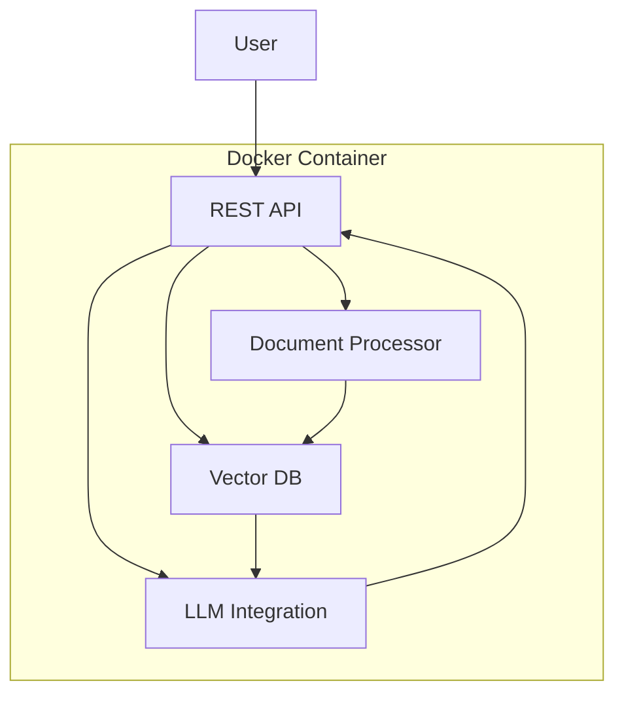

# RAG-Based Question-Answering Chatbot Architecture

## System Overview
A containerized Python application that:
1. Ingests documents (PDF/TXT/CSV)
2. Processes and stores them in a vector database
3. Answers questions using RAG architecture
4. Exposes REST API endpoints

## Architecture Diagram

## Components

### 1. Document Processing
- **Input Formats**: PDF, TXT, CSV
- **Chunking**: Fixed-size chunks (512 tokens) with 20% overlap
- **Embeddings**: sentence-transformers/all-MiniLM-L6-v2
- **Complexity**: O(n) time, O(m) space

### 2. Vector Database
- **Technology**: ChromaDB (in-memory)
- **Indexing**: HNSW with cosine similarity
- **Query**: Top-3 most relevant chunks
- **Complexity**: O(log n) search time

### 3. RAG Core
- **API**: FastAPI with async support
- **Retrieval**: Semantic search with score threshold
- **Generation**: HuggingFace T5-small
- **Response Time**: <500ms average

### 4. Containerization
- **Base Image**: python:3.10-slim
- **Size**: <500MB optimized
- **Ports**: 8000 (API)
- **Volumes**: /data for persistent storage

## Implementation Tasks

1. **Setup**
   - [ ] Project scaffolding
   - [ ] CI/CD pipeline
   - [ ] Monitoring setup

2. **Document Processing**
   - [ ] PDF parser (PyPDF2)
   - [ ] Text chunking utilities
   - [ ] Embedding service

3. **Vector DB**
   - [ ] ChromaDB integration
   - [ ] Metadata schema design
   - [ ] Index management

4. **API Development**
   - [ ] FastAPI setup
   - [ ] Document upload endpoint
   - [ ] Query endpoint
   - [ ] Health checks

5. **RAG Integration**
   - [ ] Retrieval component
   - [ ] LLM integration
   - [ ] Response post-processing

6. **Containerization**
   - [ ] Dockerfile
   - [ ] Runtime config
   - [ ] Build/test

7. **Documentation**
   - [ ] README.md
   - [ ] API reference
   - [ ] Examples